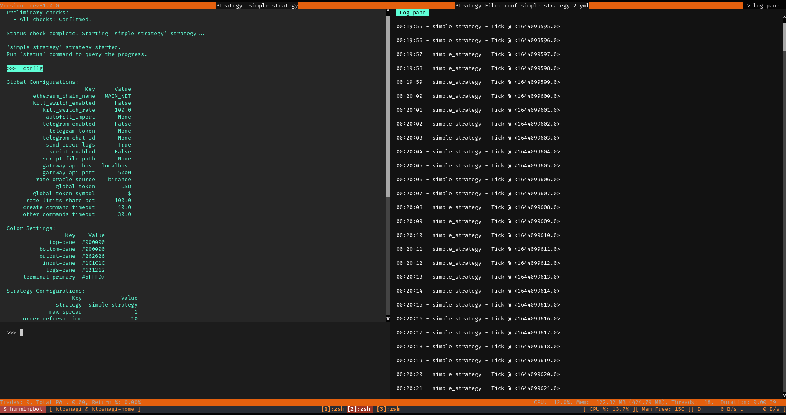

# hummingbot-strategy-dsl
Domain-Specific Language (DSL) for creating hummingbot AMM strategies, aka
**hbot strategies**.

This package contains the metamodels and the grammar of the language, and a code
generator for automated generation of software components required for the
creation and deployment of new strategies.

Furthermore, a CLI interface is provided so as to validate and generate hbot
strategy projects from input model files.


# Minimize Required Effort to Start Developing Strategies

As mentioned in [hummingbot#4715](https://github.com/hummingbot/hummingbot/issues/4715),
currently to create a new strategy, a user needs to understand various inner workings of Hummingbot and to maintain a minimum of 5 files

```
[strategy]_config_map.py
Details configurations needed for a strategy.

conf_[strategy]_TEMPLATE.yml
Formats a configuration file with comments and version number.

conf_[strategy].yml
A configuration file, created automatically by the 2 files above. A user can change the setting either by using config command or by updating the file manually

start.py
Initialises the strategy, connectors and market_info objects.

[strategy].py
The main strategy file which users need to care about the most.
```

By digging into these files, we noticed that the same information is used, which is essentially the core attributes of a Strategy:

- Name
- Description
- Markets
- Parameters

By providing this information, the aforementioned files can be auto-generated
from input models describing the strategies. In this context, the
`hbot-strategy-dsl` provides means of auto-generating strategies from input
models.

The set of these files define an `Hbot Strategy Project`!

# Installation

Install as a simple python package.

```bash
pip install .
```

Or install in development mode:

```bash
python setup.py develop
```

The installation includes an executable cli which can be used for the validation
and generation of strategy model files.

# User Guide

## Model Creation

The grammar of the DSL is developed using the [textX](https://github.com/textX/textX)
framework.

The grammar definition is located in the [grammar/strategy.tx](https://github.com/klpanagi/hbot-strategy-dsl/blob/main/hbot_strategy_dsl/grammar/strategy.tx) directory of this package.

Models are defined within a simple file with the `.strategy` extension. The
grammar is json-like, with extra buildins for defining several concepts.

Below is an example of a strategy which connects to 2 markets and has 2
parameters.

```
name: SimpleStrategy
version: "0.0.1"
description: "Example of a simple strategy model"
markets: [
    Market(Binance('MY_API_KEY', 'MY_API_SECRET'), Pair('ADA-USDT')),
    Market(AscentEX('MY_API_KEY', 'MY_API_SECRET'), Pair('ADA-USDT'))
]
parameters: [
    Param(
        name=max_spread,
        type=float,
        default=1.0,
        description="The maximum spread value",
    ),
    Param(
        name=order_refresh_time,
        type=int,
        default=10,
        description="How far away from the mid price do you want to place bid and ask orders",
    )
]
```

The DSL currenntly provides buildins for defining `Markets`,`Exchanges`, `Pairs`
and `Params`.

Note that at least one market and one parameter must be defined for the model to
be considered valid.

A Market can be defined using the `Market` building, which requires 2 arguments;
1) The `Exchange` and 2) the `Market Pair`. Currently, the following exchanges
are supported:

- Binance(API_KEY, API_SECRET)
- AscentEX(API_KEY, API_SECRET)

The `Pair` buildin has a simple argument; `Pair("<MARKET_PAIR>")`.

To support definition of strategy parameters, the language provides the `Param`
buildin. The following arguments are supported:

- name (str)
- type (One of: int|float|str|bool|list|dict)
- description (str)
- prompt_msg (str)
- default (int|float|str|bool|list|dict)
- keyword (str)
- dynamic_reconfigure (bool)
- prompt_on_new (bool)


## Strategy Project Generation

To generate a new strategy project from an input model, use the `hbot` cli:

```bash
hbot generate <PATH_TO_MODEL_FILE>
```

The generator will create a new directory with all files included.

```
current_dir
  - my_strategy_model.strategy
  - gen/
    * start.py
    * my_strategy.py
    * __init__.py
    * conf_simple_strategy_config_map.py
    * conf_simple_strategy_strategy_TEMPLATE.yml
```

The generated strategy, in current version of the **Hbot DSL**, is dummy and
does not include any logic.
Though it prints the timestamp on each tick :metal:



## Build the generated strategy

First, the `HUMMINGBOT_REPO_DIR` environmental variable must be set, pointing
at the hummingbot client repo directory.

```
export HUMMINGBOT_REPO_DIR=~/Development/hummingbot
```

Next use the `hbot build` command.

```
hbot build <GEN_SRC_DIR> <STRATEGY_NAME>
```

And then recompile hummingbot client:

```
cd ${HUMMINGBOT_REPO_DIR} && ./compile
```

# Examples

## Simple Strategy Example

A simple strategy defined using the DSL is located in the [examples/simple_example](hbot_strategy_dsl/examples/simple_example) directory.


# TODO

- Market Initialization in generated strategy
- Parameter Validator Concept in DSL
- Support parameter validators in code generator
